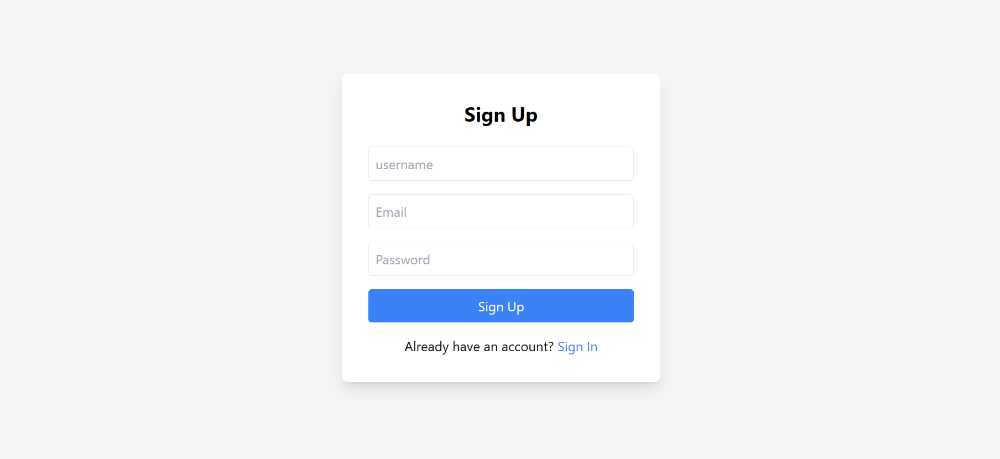
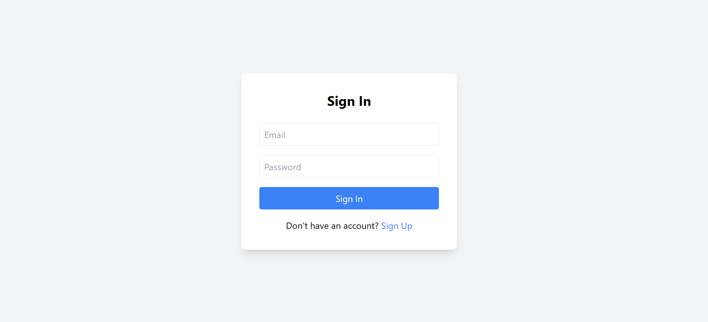

Advanced React To-Do Application with API Integration
📌 Overview
This Advanced React To-Do Application is a feature-rich task management tool built with React.js, Redux Toolkit, and Redux Thunk. It allows users to add, view, and delete tasks while integrating weather data from an external API. The application supports authentication, task prioritization, and persistent storage via local storage. It follows responsive design principles for an optimal experience across devices.

🚀 Features
✅ Add, View, and Delete Tasks – Users can add tasks, view them in a list format, and remove them when completed.
✅ Task Prioritization – Set task priority levels (High, Medium, Low) for better task organization.
✅ Weather API Integration – Displays real-time weather information when adding outdoor-related tasks.
✅ User Authentication – Simulated login/logout using Redux state management (no backend required).
✅ Persistent Storage – Tasks and authentication status persist across sessions using local storage.
✅ Redux Toolkit & Thunk – Efficient state management and async API calls using Redux Thunk.
✅ Responsive Design – The UI is fully responsive, built with CSS Flexbox & Grid for mobile-first usability.

📂 Project Structure
pgsql
Copy
Edit
📦 Advanced-Todo  
 ┣ 📂 src  
 ┃ ┣ 📂 components  
 ┃ ┃ ┣ 📜 TaskInput.js  
 ┃ ┃ ┣ 📜 TaskList.js  
 ┃ ┣ 📂 redux  
 ┃ ┃ ┣ 📂 slices  
 ┃ ┃ ┃ ┣ 📜 taskSlice.js  
 ┃ ┃ ┃ ┣ 📜 authSlice.js  
 ┃ ┃ ┣ 📜 store.js  
 ┃ ┣ 📜 App.js  
 ┃ ┣ 📜 index.js  
 ┃ ┣ 📜 styles.css  
 ┣ 📜 package.json  
 ┣ 📜 README.md  
🛠️ Technologies Used
React.js (Functional Components & Hooks)

Redux Toolkit & Redux Thunk (State Management & Async API Calls)

React Router (Navigation)

Local Storage (Data Persistence)

Tailwind CSS / Bootstrap (Styling)

Weather API (External API Integration)

⚡ Getting Started
1️⃣ Clone the Repository
sh
Copy
Edit
git clone https://github.com/student-vishalkumar/Advanced-Todo.git
cd Advanced-Todo
2️⃣ Install Dependencies
sh
Copy
Edit
npm install
3️⃣ Set Up Environment Variables
Create a .env file in the project root and add your Weather API Key:

ini
Copy
Edit
REACT_APP_WEATHER_API_KEY=your_api_key_here
🌟 Get an API key from OpenWeather.

4️⃣ Start the Development Server
sh
Copy
Edit
npm start
The application will be accessible at http://localhost:3000 🎉.

📸 Screenshots
🔹 

🔹 

🔹 

📝 Usage Guide
🔹 1. User Authentication
Click Login to access the task list.

Click Logout to protect tasks.

🔹 2. Adding a Task
Enter task details in the input field.

Set task priority (High, Medium, Low).

Click Add Task to save it.

🔹 3. Viewing Tasks
All tasks are displayed in a list with priority indicators.

🔹 4. Deleting a Task
Click the Delete button next to a task to remove it.

🔹 5. Weather Integration
If a task is related to outdoor activities, weather info is displayed.
